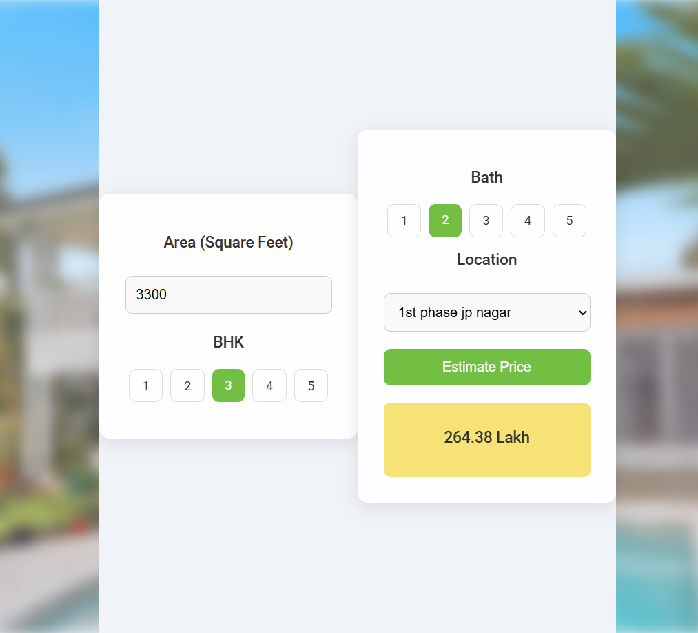

# Bangalore Home Price Prediction

This is a web application that estimates the price of a house in Bangalore based on features like area (square feet), number of BHK (bedrooms, halls, and kitchens), bathrooms, and location. The model uses a trained machine learning algorithm to predict the prices based on historical data.

## Table of Contents

- [Bangalore Home Price Prediction](#bangalore-home-price-prediction)
  - [Table of Contents](#table-of-contents)
  - [Overview](#overview)
  - [Features](#features)
  - [Tools \& Technologies Used](#tools--technologies-used)
  - [Installation](#installation)
  - [Usage](#usage)
  - [Dataset](#dataset)
  - [Model Training](#model-training)
  - [Screenshot](#screenshot)

## Overview

This project implements a simple Flask-based web application that allows users to input information about a house and get an estimated price. It leverages machine learning techniques to make the predictions based on historical Bangalore home price data.

## Features

- Predict the price of a house based on area, number of BHK, bathrooms, and location.
- Responsive design for user-friendly experience.
- Simple and intuitive user interface.
- Model trained using multiple features from the dataset.

## Tools & Technologies Used

- **Frontend**: HTML, CSS, JavaScript
- **Backend**: Flask, Python 3.x
- **Machine Learning**: Scikit-learn, Pandas, NumPy
- **Other Libraries**: Matplotlib (for visualizations)

## Installation

To run this project locally, follow these steps:

1. Clone this repository:

   ```bash
   git clone https://github.com/your-username/bangalore-home-price-prediction.git
   cd bangalore-home-price-prediction
   ```

2. Create a virtual environment and activate it:

   ```bash
   python3 -m venv venv
   source venv/bin/activate   # On Windows use `venv\Scripts\activate`
   ```

3. Install the required packages:

   ```bash
   pip install -r requirements.txt
   ```

4. Run the Flask application:

   ```bash
   python app.py
   ```

5. Open your browser and navigate to `http://localhost:5000` to see the web interface.

## Usage

1. Input the **area in square feet**.
2. Select the **number of BHK**.
3. Select the **number of bathrooms**.
4. Choose the **location** from the dropdown list.
5. Click on **Estimate Price** to get the predicted price of the house.

## Dataset

The dataset used for this project includes historical housing price data from Bangalore. Key features used in the model include:

- Total square feet
- Number of BHK (bedrooms, halls, kitchens)
- Number of bathrooms
- Location

The dataset has been preprocessed to handle missing values and categorical features.

## Model Training

The machine learning model is trained using **Linear Regression** from the Scikit-learn library. The steps involved in model training are:

1. Data Preprocessing: Handle missing values and convert categorical data into numerical form.
2. Model Training: The model is trained using Linear Regression.
3. Model Evaluation: The model is evaluated on a test set using metrics like R² and Mean Squared Error (MSE).

## Screenshot

Here’s a screenshot of the web page:


